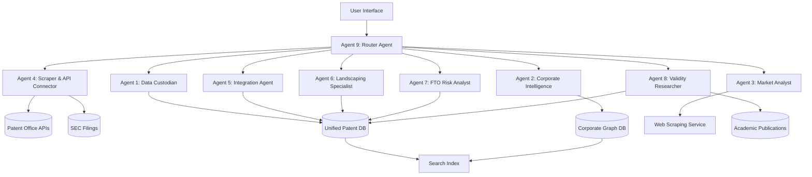
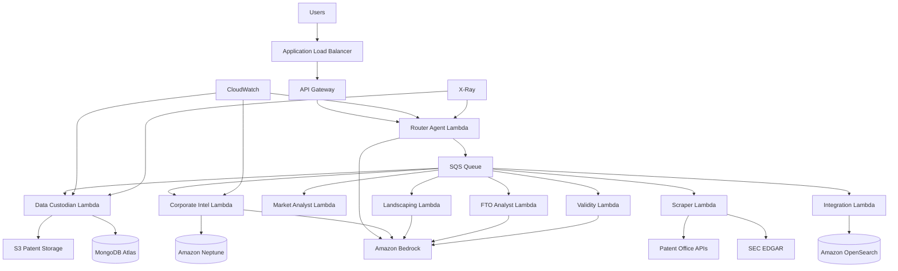

# Design Document: Project Knot - Agentic IP Intelligence Mesh

## Overview

Project Knot is a multi-agent orchestration framework that democratizes IP intelligence for Indian MSMEs and startups. The system addresses three critical challenges:

1. **Fragmented Data**: Automated ingestion and normalization from USPTO, EPO, and CGPDTM
2. **Hidden Ownership**: Graph-based corporate intelligence with 90%+ accuracy in identifying ultimate parent companies
3. **Siloed Context**: Linking patents to products, identifying white spaces, and providing strategic R&D insights

### Architecture Philosophy

The system follows a layered approach with specialized agents coordinated by a central Router Agent:
- **Layer 1-2**: Data ingestion and sanitization (Agents 1, 4, 5)
- **Layer 3**: Contextual enrichment (Agents 2, 3)
- **Layer 4**: Specialized IP reasoning (Agents 6, 7, 8)
- **Layer 5**: Cognitive interface (Agent 9 - Router)

### Key Performance Targets

- **Speed**: <10 minute response times for FTO queries (down from 2 weeks)
- **Accuracy**: 90%+ accuracy in corporate ownership resolution
- **Coverage**: Comprehensive data from USPTO, EPO, and CGPDTM patent offices
- **Value**: Provide "protective shield" for Indian startups against international patent trolls

## Architecture

### System Components



### Technology Stack

- **LLM Infrastructure**: Amazon Bedrock with Claude 3.7/3.5 Sonnet for reasoning
- **Agent Orchestration**: Event-driven architecture with message queues
- **Data Storage**: 
  - Document store for patent documents (MongoDB/DocumentDB)
  - Graph database for corporate relationships (Neo4j/Neptune)
  - Search index for full-text queries (Elasticsearch/OpenSearch)
- **API Integration**: REST clients for USPTO, EPO, CGPDTM APIs
- **Web Scraping**: Headless browser automation (Playwright/Puppeteer)
- **Compute**: Serverless functions (AWS Lambda) for agent execution
- **Monitoring**: CloudWatch for metrics, X-Ray for distributed tracing

### Agent Communication Protocol

Agents communicate through a standardized message format:

```json
{
  "request_id": "uuid",
  "source_agent": "agent_name",
  "target_agent": "agent_name",
  "task_type": "task_identifier",
  "payload": {
    "input_data": {},
    "context": {},
    "parameters": {}
  },
  "priority": "high|medium|low",
  "timeout_ms": 300000
}
```

Responses follow a similar structure:

```json
{
  "request_id": "uuid",
  "agent": "agent_name",
  "status": "success|partial|failure",
  "result": {},
  "confidence_score": 0.95,
  "execution_time_ms": 1234,
  "errors": []
}
```

## Components and Interfaces

### Agent 9: Router Agent (Central Orchestrator)

**Responsibilities:**
- Parse user queries and extract intent
- Determine which specialized agents to invoke
- Manage agent execution sequence and dependencies
- Aggregate results from multiple agents
- Synthesize final response for user

**Key Interfaces:**

```typescript
interface RouterAgent {
  parseQuery(query: string): QueryIntent;
  planExecution(intent: QueryIntent): ExecutionPlan;
  orchestrateAgents(plan: ExecutionPlan): Promise<AgentResults>;
  synthesizeResponse(results: AgentResults): UserResponse;
}

interface QueryIntent {
  primary_goal: "fto_analysis" | "landscape" | "validity" | "corporate_intel";
  entities: {
    patents?: string[];
    companies?: string[];
    technologies?: string[];
    products?: string[];
  };
  constraints: {
    jurisdictions?: string[];
    date_range?: DateRange;
    risk_threshold?: number;
  };
}

interface ExecutionPlan {
  stages: AgentStage[];
  dependencies: Map<string, string[]>;
  timeout_ms: number;
}

interface AgentStage {
  agent_id: string;
  task_type: string;
  inputs: any;
  depends_on: string[];
}
```

**Algorithm:**

1. **Query Parsing**: Use Claude LLM to extract structured intent from natural language
2. **Agent Selection**: Rule-based mapping from intent to required agents
3. **Dependency Resolution**: Topological sort of agent dependencies
4. **Parallel Execution**: Execute independent agents concurrently
5. **Result Aggregation**: Collect and merge results with conflict resolution
6. **Response Synthesis**: Generate user-friendly summary with Claude LLM

### Agent 1: Data Custodian

**Responsibilities:**
- OCR extraction from patent PDFs
- Text normalization and cleaning
- Field extraction and validation
- Language detection and processing

**Key Interfaces:**

```typescript
interface DataCustodian {
  processPatentPDF(pdf: Buffer): Promise<PatentDocument>;
  normalizeText(raw: string): string;
  extractFields(text: string): PatentFields;
  validateDocument(doc: PatentDocument): ValidationResult;
}

interface PatentDocument {
  id: string;
  source: "USPTO" | "EPO" | "CGPDTM";
  publication_number: string;
  title: string;
  abstract: string;
  claims: Claim[];
  assignees: string[];
  inventors: string[];
  filing_date: Date;
  publication_date: Date;
  classifications: Classification[];
  raw_text: string;
  language: string;
}

interface Claim {
  number: number;
  type: "independent" | "dependent";
  depends_on?: number;
  text: string;
  normalized_text: string;
}
```

**Processing Pipeline:**

1. **OCR Extraction**: Use Tesseract or AWS Textract for PDF text extraction
2. **Noise Removal**: Remove headers, footers, page numbers, artifacts
3. **Section Detection**: Identify title, abstract, claims, description sections
4. **Claim Parsing**: Extract individual claims and dependency relationships
5. **Field Validation**: Ensure required fields present and properly formatted
6. **Normalization**: Standardize dates, names, classification codes

### Agent 4: Scraper & API Connector

**Responsibilities:**
- Connect to USPTO, EPO, CGPDTM APIs
- Fetch new patent publications
- Scrape SEC filings for corporate data
- Handle rate limiting and retries
- Queue documents for processing

**Key Interfaces:**

```typescript
interface ScraperAgent {
  fetchPatents(source: PatentSource, since: Date): Promise<PatentMetadata[]>;
  fetchSECFilings(company: string): Promise<SECFiling[]>;
  scheduleIngestion(metadata: PatentMetadata): void;
}

interface PatentSource {
  name: "USPTO" | "EPO" | "CGPDTM";
  api_endpoint: string;
  auth_config: AuthConfig;
  rate_limit: RateLimit;
}

interface PatentMetadata {
  publication_number: string;
  publication_date: Date;
  download_url: string;
  source: string;
}

interface SECFiling {
  company: string;
  filing_type: "10-K" | "8-K" | "DEF 14A";
  filing_date: Date;
  content: string;
  subsidiaries: string[];
  acquisitions: Acquisition[];
}
```

**Ingestion Strategy:**

1. **Incremental Sync**: Track last sync timestamp per source
2. **Bulk Download**: Fetch metadata for new publications
3. **Priority Queue**: Prioritize recent publications and user-requested patents
4. **Rate Limiting**: Implement token bucket algorithm for API calls
5. **Retry Logic**: Exponential backoff with jitter for failed requests
6. **Health Monitoring**: Track API availability and alert on failures

### Agent 5: Integration Agent

**Responsibilities:**
- Map data from multiple sources to unified schema
- Detect and merge duplicate patents
- Resolve data conflicts
- Update search index

**Key Interfaces:**

```typescript
interface IntegrationAgent {
  mapToUnifiedSchema(doc: any, source: string): UnifiedPatent;
  detectDuplicates(patent: UnifiedPatent): string[];
  mergeRecords(patents: UnifiedPatent[]): UnifiedPatent;
  resolveConflicts(field: string, values: any[]): any;
  updateIndex(patent: UnifiedPatent): Promise<void>;
}

interface UnifiedPatent {
  unified_id: string;
  source_ids: Map<string, string>;
  canonical_data: PatentDocument;
  source_specific_data: Map<string, any>;
  last_updated: Date;
  confidence_scores: Map<string, number>;
}
```

**Integration Algorithm:**

1. **Schema Mapping**: Apply source-specific transformation rules
2. **Duplicate Detection**: Compare publication numbers, titles, assignees
3. **Conflict Resolution**: Prioritize most recent authoritative source
4. **Merge Strategy**: Combine all source references, use canonical data
5. **Index Update**: Bulk update search index with merged records

### Agent 2: Corporate Intelligence Agent

**Responsibilities:**
- Map patent assignees to ultimate parent companies
- Build and maintain corporate ownership graph
- Track M&A events and update relationships
- Resolve shell companies and subsidiaries

**Key Interfaces:**

```typescript
interface CorporateIntelligenceAgent {
  resolveUltimateParent(assignee: string): Promise<Company>;
  buildOwnershipGraph(company: string): Promise<OwnershipGraph>;
  trackMergerAcquisition(event: MAAEvent): void;
  updateOwnershipRelationships(): Promise<void>;
}

interface Company {
  canonical_name: string;
  aliases: string[];
  ultimate_parent: string | null;
  subsidiaries: string[];
  jurisdiction: string;
  lei_code?: string;
}

interface OwnershipGraph {
  nodes: CompanyNode[];
  edges: OwnershipEdge[];
}

interface CompanyNode {
  id: string;
  name: string;
  type: "parent" | "subsidiary" | "shell";
}

interface OwnershipEdge {
  from: string;
  to: string;
  ownership_percentage: number;
  effective_date: Date;
  source: string;
}

interface MAAEvent {
  acquirer: string;
  target: string;
  announcement_date: Date;
  completion_date: Date;
  transaction_value?: number;
}
```

**Resolution Algorithm:**

1. **Name Normalization**: Standardize company names (remove Inc., Ltd., etc.)
2. **Database Lookup**: Query corporate databases (OpenCorporates, LEI database)
3. **Graph Traversal**: Follow ownership edges to find ultimate parent
4. **Cycle Detection**: Handle circular ownership structures
5. **Confidence Scoring**: Assign confidence based on data source quality
6. **Cache Results**: Store resolved mappings for performance

**Graph Database Schema (Neo4j):**

```cypher
// Company node
CREATE (c:Company {
  id: 'uuid',
  canonical_name: 'string',
  aliases: ['string'],
  jurisdiction: 'string',
  lei_code: 'string'
})

// Ownership relationship
CREATE (parent:Company)-[:OWNS {
  percentage: float,
  effective_date: date,
  source: 'string'
}]->(subsidiary:Company)

// Patent assignment
CREATE (company:Company)-[:ASSIGNED {
  assignment_date: date,
  patent_id: 'string'
}]->(patent:Patent)
```

### Agent 3: Market Analyst

**Responsibilities:**
- Scrape web for product disclosures
- Link patents to commercial products
- Extract product specifications
- Assign confidence scores to linkages

**Key Interfaces:**

```typescript
interface MarketAnalyst {
  findProductMatches(patent: PatentDocument): Promise<ProductMatch[]>;
  scrapeProductInfo(product_url: string): Promise<ProductInfo>;
  compareSpecifications(patent_claims: Claim[], product_specs: any): number;
  assignConfidenceScore(match: ProductMatch): number;
}

interface ProductMatch {
  patent_id: string;
  product_name: string;
  product_url: string;
  manufacturer: string;
  confidence_score: number;
  matching_claims: number[];
  evidence: string[];
}

interface ProductInfo {
  name: string;
  manufacturer: string;
  description: string;
  specifications: Map<string, any>;
  release_date?: Date;
  availability: "commercial" | "prototype" | "discontinued";
}
```

**Matching Algorithm:**

1. **Keyword Extraction**: Extract technical terms from patent claims
2. **Web Search**: Query search engines with patent keywords + "product"
3. **Content Scraping**: Extract product pages and datasheets
4. **Specification Parsing**: Extract technical specifications from product pages
5. **Similarity Scoring**: Compare patent claims to product features using embeddings
6. **Confidence Assignment**: Based on match quality and source authority

### Agent 6: Landscaping Specialist

**Responsibilities:**
- Cluster patents by technical concepts
- Identify patent density regions
- Find white spaces (low patent coverage)
- Rank R&D opportunities

**Key Interfaces:**

```typescript
interface LandscapingSpecialist {
  clusterPatents(domain: string): Promise<PatentCluster[]>;
  identifyWhiteSpaces(clusters: PatentCluster[]): WhiteSpace[];
  rankOpportunities(spaces: WhiteSpace[]): RankedOpportunity[];
  generateVisualization(landscape: TechLandscape): Visualization;
}

interface PatentCluster {
  id: string;
  centroid: number[];
  patents: string[];
  keywords: string[];
  density: number;
}

interface WhiteSpace {
  id: string;
  description: string;
  adjacent_clusters: string[];
  opportunity_score: number;
  market_size_estimate?: number;
}

interface RankedOpportunity {
  white_space: WhiteSpace;
  rank: number;
  rationale: string;
  competitive_intensity: "low" | "medium" | "high";
}
```

**Clustering Algorithm:**

1. **Embedding Generation**: Use Claude to generate embeddings for patent abstracts
2. **Dimensionality Reduction**: Apply UMAP to reduce to 2D/3D space
3. **Clustering**: Use DBSCAN to identify dense regions
4. **Gap Detection**: Find regions with low patent density
5. **Opportunity Scoring**: Combine density, market size, competitive activity
6. **Visualization**: Generate interactive scatter plots with cluster labels

### Agent 7: FTO Risk Analyst

**Responsibilities:**
- Identify potentially infringing patents
- Perform claim-by-claim analysis
- Assign risk levels (high/medium/low)
- Generate FTO reports

**Key Interfaces:**

```typescript
interface FTORiskAnalyst {
  identifyRelevantPatents(product: ProductDescription): Promise<Patent[]>;
  analyzeInfringement(patent: Patent, product: ProductDescription): InfringementAnalysis;
  assignRiskLevel(analysis: InfringementAnalysis): RiskLevel;
  generateFTOReport(analyses: InfringementAnalysis[]): FTOReport;
}

interface ProductDescription {
  name: string;
  features: string[];
  technical_specifications: Map<string, any>;
  target_markets: string[];
  planned_launch_date?: Date;
}

interface InfringementAnalysis {
  patent_id: string;
  product_id: string;
  matching_claims: ClaimMatch[];
  overall_risk: RiskLevel;
  rationale: string;
  mitigation_options: string[];
}

interface ClaimMatch {
  claim_number: number;
  claim_text: string;
  product_features: string[];
  match_confidence: number;
  infringement_likelihood: "high" | "medium" | "low" | "none";
}

type RiskLevel = "high" | "medium" | "low" | "none";

interface FTOReport {
  product: ProductDescription;
  analysis_date: Date;
  total_patents_reviewed: number;
  high_risk_patents: InfringementAnalysis[];
  medium_risk_patents: InfringementAnalysis[];
  low_risk_patents: InfringementAnalysis[];
  recommendations: string[];
  estimated_clearance_cost?: number;
}
```

**FTO Analysis Algorithm:**

1. **Patent Retrieval**: Search for patents matching product technical domain
2. **Filtering**: Exclude expired, abandoned, or geographically irrelevant patents
3. **Claim Parsing**: Extract independent and dependent claims
4. **Feature Mapping**: Map product features to claim elements
5. **Infringement Assessment**: Use Claude LLM for claim-by-claim analysis
6. **Risk Aggregation**: Combine claim-level risks into patent-level risk
7. **Report Generation**: Synthesize findings with recommendations

### Agent 8: Validity Researcher

**Responsibilities:**
- Search for prior art
- Compare prior art to patent claims
- Generate validity reports
- Cite relevant passages

**Key Interfaces:**

```typescript
interface ValidityResearcher {
  searchPriorArt(patent: Patent): Promise<PriorArtCandidate[]>;
  compareToClaims(prior_art: PriorArtCandidate, patent: Patent): PriorArtAnalysis;
  generateValidityReport(analyses: PriorArtAnalysis[]): ValidityReport;
}

interface PriorArtCandidate {
  id: string;
  type: "patent" | "publication" | "standard" | "product";
  title: string;
  publication_date: Date;
  source: string;
  url: string;
  relevant_passages: string[];
}

interface PriorArtAnalysis {
  prior_art_id: string;
  patent_id: string;
  claim_mappings: ClaimPriorArtMapping[];
  overall_relevance: number;
  invalidation_potential: "high" | "medium" | "low";
}

interface ClaimPriorArtMapping {
  claim_number: number;
  prior_art_passages: string[];
  coverage_percentage: number;
  notes: string;
}

interface ValidityReport {
  patent_id: string;
  analysis_date: Date;
  prior_art_found: number;
  high_relevance_prior_art: PriorArtAnalysis[];
  conclusion: string;
  recommended_actions: string[];
}
```

**Prior Art Search Algorithm:**

1. **Keyword Extraction**: Extract technical terms from patent claims
2. **Multi-Source Search**: Query Google Scholar, patent databases, standards bodies
3. **Date Filtering**: Only include publications before patent priority date
4. **Relevance Ranking**: Use embedding similarity to rank candidates
5. **Passage Extraction**: Identify specific passages matching claim elements
6. **Coverage Analysis**: Calculate percentage of claim elements covered
7. **Report Synthesis**: Generate structured validity report

## Data Models

### Core Entities

**Patent Document:**
```typescript
interface Patent {
  unified_id: string;
  publication_number: string;
  source: "USPTO" | "EPO" | "CGPDTM";
  title: string;
  abstract: string;
  claims: Claim[];
  description: string;
  assignees: string[];
  inventors: Inventor[];
  filing_date: Date;
  publication_date: Date;
  priority_date: Date;
  expiration_date: Date;
  status: "active" | "expired" | "abandoned" | "pending";
  classifications: Classification[];
  citations: Citation[];
  family_members: string[];
  embeddings: number[];
}

interface Inventor {
  name: string;
  country: string;
}

interface Classification {
  system: "IPC" | "CPC" | "USPC";
  code: string;
  description: string;
}

interface Citation {
  cited_patent_id: string;
  citation_type: "examiner" | "applicant";
}
```

**User Query:**
```typescript
interface UserQuery {
  query_id: string;
  user_id: string;
  query_text: string;
  query_intent: QueryIntent;
  execution_plan: ExecutionPlan;
  results: QueryResults;
  created_at: Date;
  completed_at?: Date;
  status: "pending" | "processing" | "completed" | "failed";
}

interface QueryResults {
  summary: string;
  detailed_findings: any;
  supporting_evidence: Evidence[];
  confidence_score: number;
  execution_time_ms: number;
}

interface Evidence {
  type: "patent" | "product" | "prior_art" | "corporate_data";
  source: string;
  content: any;
  relevance_score: number;
}
```

### Database Schema Design

**Document Store (MongoDB):**
- Collection: `patents` - Full patent documents with embeddings
- Collection: `queries` - User query history and results
- Collection: `products` - Scraped product information
- Collection: `prior_art` - Academic publications and standards

**Graph Database (Neo4j):**
- Nodes: `Company`, `Patent`, `Product`, `Inventor`
- Relationships: `OWNS`, `ASSIGNED`, `CITES`, `SIMILAR_TO`, `INVENTED_BY`

**Search Index (Elasticsearch):**
- Index: `patents` - Full-text search on title, abstract, claims
- Index: `companies` - Company name search with fuzzy matching
- Index: `products` - Product name and specification search

## Correctness Properties

*A property is a characteristic or behavior that should hold true across all valid executions of a system—essentially, a formal statement about what the system should do. Properties serve as the bridge between human-readable specifications and machine-verifiable correctness guarantees.*


### Property 1: Query Intent Parsing Correctness

*For any* user query in natural language, the Router Agent should correctly identify the primary goal (FTO analysis, landscape, validity, or corporate intelligence) and extract relevant entities (patents, companies, technologies, products).

**Validates: Requirements 1.1, 10.1**

### Property 2: Agent Dependency Ordering

*For any* execution plan with agent dependencies, when the Router Agent orchestrates execution, agents should execute only after all their dependencies have completed successfully.

**Validates: Requirements 1.2**

### Property 3: Result Aggregation Completeness

*For any* set of agent results, the Router Agent's aggregation should preserve all findings from individual agents and correctly merge overlapping information without data loss.

**Validates: Requirements 1.3, 1.4**

### Property 4: OCR Text Extraction Completeness

*For any* valid patent PDF document, the Data Custodian's OCR extraction should produce text output that contains all visible text from the original document.

**Validates: Requirements 2.1**

### Property 5: Text Normalization Idempotence

*For any* extracted patent text, applying normalization twice should produce the same result as applying it once (normalization is idempotent).

**Validates: Requirements 2.2**

### Property 6: Language Detection Accuracy

*For any* patent document containing text in a supported language (English, Hindi, German, French, Japanese), the Data Custodian should correctly identify the primary language.

**Validates: Requirements 2.3, 16.3**

### Property 7: Field Validation Completeness

*For any* normalized patent document, validation should correctly identify all missing required fields and all malformed field values.

**Validates: Requirements 2.4**

### Property 8: Error Logging Consistency

*For any* system error (validation failure, ingestion failure, mapping failure, unresolved ownership), the system should log the error with timestamp, error type, affected entity ID, and diagnostic details.

**Validates: Requirements 2.5, 3.5, 4.5, 5.5**

### Property 9: Exponential Backoff Behavior

*For any* sequence of API rate limit errors, the retry delays should follow exponential backoff pattern (each retry waits longer than the previous one).

**Validates: Requirements 3.3, 13.2**

### Property 10: Corporate Data Extraction from SEC Filings

*For any* SEC filing (10-K, 8-K, DEF 14A) containing subsidiary or acquisition information, the Scraper Agent should extract all mentioned corporate entities and their relationships.

**Validates: Requirements 3.4**

### Property 11: Schema Mapping Consistency

*For any* patent data from a supported source (USPTO, EPO, CGPDTM), the Integration Agent should map it to the unified schema such that all required fields are populated and field types are correct.

**Validates: Requirements 4.1**

### Property 12: Duplicate Merging Preserves Sources

*For any* set of duplicate patent records from different sources, merging should produce a unified record that contains source IDs from all original records.

**Validates: Requirements 4.2**

### Property 13: Conflict Resolution Priority

*For any* conflicting field values from different sources, the Integration Agent should select the value from the most recent authoritative source according to defined priority rules (most recent publication date, then source authority ranking).

**Validates: Requirements 4.3**

### Property 14: Search Index Synchronization

*For any* patent integrated into the unified database, the search index should be updated such that the patent becomes findable through full-text search within the same transaction.

**Validates: Requirements 4.4**

### Property 15: Graph Traversal Finds Ultimate Parent

*For any* ownership graph with a connected path from a subsidiary to an ultimate parent company, graph traversal should correctly identify the ultimate parent (the node with no outgoing ownership edges).

**Validates: Requirements 5.2, 17.2**

### Property 16: M&A Event Graph Updates

*For any* M&A event with acquirer, target, and effective date, updating the ownership graph should create or modify edges such that the target becomes a subsidiary of the acquirer with the correct effective date.

**Validates: Requirements 5.3, 17.3**

### Property 17: Product Matching Confidence Scoring

*For any* patent-product pair analyzed by the Market Analyst, a confidence score between 0 and 1 should be assigned based on the similarity between patent claims and product features.

**Validates: Requirements 6.4**

### Property 18: Patent Clustering Consistency

*For any* technology domain and set of patents, clustering should produce clusters where patents within a cluster are more similar to each other than to patents in different clusters (cluster cohesion property).

**Validates: Requirements 7.1**

### Property 19: White Space Identification from Clusters

*For any* set of patent clusters in a 2D/3D embedding space, identified white spaces should be regions with patent density below a defined threshold and should be spatially separated from high-density clusters.

**Validates: Requirements 7.2**

### Property 20: White Space Ranking Monotonicity

*For any* two white spaces where space A has higher market size and lower competitive intensity than space B, space A should be ranked higher than space B in R&D opportunity ranking.

**Validates: Requirements 7.3**

### Property 21: Expired Patent Exclusion from FTO

*For any* FTO risk analysis, patents with expiration dates before the current date or with "expired" or "abandoned" status should not appear in the risk assessment results.

**Validates: Requirements 8.5**

### Property 22: Prior Art Date Filtering

*For any* patent validity research, prior art candidates should only include publications with publication dates before the target patent's priority date.

**Validates: Requirements 9.2**

### Property 23: Result Prioritization by Relevance

*For any* set of query results with assigned relevance scores, the system should present results in descending order of relevance score.

**Validates: Requirements 10.3**

### Property 24: Risk Assessment Includes Recommendations

*For any* FTO risk assessment result containing high or medium risk patents, the system response should include at least one actionable recommendation (e.g., design around, license, challenge validity).

**Validates: Requirements 10.4**

### Property 25: Partial Results on Agent Failure

*For any* multi-agent query where some agents succeed and others fail after retries, the system should return partial results from successful agents along with error information about failed agents.

**Validates: Requirements 11.5**

### Property 26: Data Encryption at Rest

*For any* sensitive user data (queries, product descriptions, proprietary information) stored in the database, the data should be encrypted using AES-256 or equivalent encryption standard.

**Validates: Requirements 12.2**

### Property 27: User Data Isolation

*For any* two different users submitting queries, the results returned to user A should not contain any data from user B's queries or proprietary information.

**Validates: Requirements 12.3**

### Property 28: Audit Log Completeness

*For any* data access operation (read, write, delete), an audit log entry should be created containing timestamp, user ID, operation type, affected resource ID, and operation result.

**Validates: Requirements 12.4**

### Property 29: Data Retention Policy Enforcement

*For any* user data with a retention policy expiration date in the past, the data should be automatically purged from all storage systems (database, backups, logs).

**Validates: Requirements 12.5**

### Property 30: LLM Input Chunking for Token Limits

*For any* input to Claude LLM that exceeds the model's token limit, the system should chunk the input into smaller segments that each fit within the limit, process them separately, and aggregate the outputs.

**Validates: Requirements 13.3**

### Property 31: LLM Response Validation

*For any* response from Claude LLM, the system should validate that the response matches the expected schema (e.g., JSON structure, required fields) before using the response in downstream processing.

**Validates: Requirements 13.4**

### Property 32: Cost Threshold Alerting

*For any* billing period where Amazon Bedrock API costs exceed the configured budget threshold, the system should send an alert to administrators and activate rate limiting.

**Validates: Requirements 13.5**

### Property 33: Agent Execution Metrics Logging

*For any* agent task execution, the system should log metrics including agent ID, task type, start time, end time, execution duration, success/failure status, and error details if failed.

**Validates: Requirements 14.1**

### Property 34: Request Tracing Completeness

*For any* user query that involves multiple agents, the distributed trace should include spans for each agent execution, showing parent-child relationships and timing information.

**Validates: Requirements 14.3**

### Property 35: SMILES Parsing Round-Trip

*For any* valid SMILES notation representing a molecular structure, parsing the SMILES string to an internal representation and then serializing back to SMILES should produce a chemically equivalent structure (canonical SMILES).

**Validates: Requirements 15.1**

### Property 36: Molecular Similarity Symmetry

*For any* two molecules A and B, the similarity score between A and B should equal the similarity score between B and A (similarity is symmetric).

**Validates: Requirements 15.4**

### Property 37: Corporate Graph Construction Completeness

*For any* corporate entity query, the constructed ownership graph should include all known subsidiaries, parent companies, and ownership relationships from the corporate database.

**Validates: Requirements 17.1**

### Property 38: Feedback Capture Completeness

*For any* user feedback submission (relevance rating, correction suggestion), the system should store the feedback with associated query ID, user ID, timestamp, and feedback content.

**Validates: Requirements 18.1**

### Property 39: Knowledge Graph Correction Propagation

*For any* user feedback indicating an incorrect corporate mapping (e.g., wrong ultimate parent), updating the knowledge graph should propagate the correction to all affected patent assignments and historical queries.

**Validates: Requirements 18.5**

### Property 40: Export Format Completeness

*For any* completed analysis exported in any format (PDF, JSON, CSV), the export should include executive summary, detailed findings, supporting evidence, timestamps, query parameters, and data source attributions.

**Validates: Requirements 19.1, 19.2, 19.3, 19.4, 19.5**

### Property 41: API Response Schema Consistency

*For any* API request to the same endpoint with valid parameters, responses should conform to the same JSON schema regardless of the specific query content.

**Validates: Requirements 20.3**

### Property 42: API Rate Limit Response Format

*For any* API request that exceeds rate limits, the system should return HTTP 429 status code with a "Retry-After" header indicating when the client can retry.

**Validates: Requirements 20.4**

## Error Handling

### Error Categories

1. **Data Quality Errors**
   - Malformed patent documents
   - Missing required fields
   - OCR extraction failures
   - Language detection failures

2. **Integration Errors**
   - API connection failures
   - Rate limit exceeded
   - Authentication failures
   - Timeout errors

3. **Processing Errors**
   - Graph traversal failures (cycles, disconnected components)
   - Clustering failures (insufficient data)
   - LLM response validation failures
   - Search index update failures

4. **User Input Errors**
   - Ambiguous queries
   - Invalid parameters
   - Unsupported file formats
   - Malformed API requests

### Error Handling Strategies

**Retry with Exponential Backoff:**
- Applied to: API calls, database operations, search index updates
- Configuration: Initial delay 100ms, max delay 30s, max retries 5
- Jitter: Add random jitter to prevent thundering herd

**Graceful Degradation:**
- Return partial results when some agents fail
- Use cached data when real-time APIs unavailable
- Provide lower-confidence results when data is incomplete

**Error Logging and Monitoring:**
- All errors logged with structured format (timestamp, error type, context, stack trace)
- Critical errors trigger alerts to administrators
- Error rates tracked as key metrics

**User-Friendly Error Messages:**
- Translate technical errors to user-understandable messages
- Provide actionable guidance (e.g., "Try refining your query" vs "NullPointerException")
- Include request ID for support inquiries

### Circuit Breaker Pattern

For external API calls (patent offices, SEC, web scraping):

```typescript
interface CircuitBreaker {
  state: "closed" | "open" | "half-open";
  failure_threshold: number;
  timeout_ms: number;
  reset_timeout_ms: number;
}
```

- **Closed**: Normal operation, requests pass through
- **Open**: Too many failures, requests fail immediately
- **Half-Open**: Testing if service recovered, limited requests allowed

## Testing Strategy

### Dual Testing Approach

The system requires both unit tests and property-based tests for comprehensive coverage:

**Unit Tests** focus on:
- Specific examples of correct behavior
- Edge cases (empty inputs, boundary values, special characters)
- Error conditions (malformed data, missing fields, invalid states)
- Integration points between components
- Mock external dependencies (APIs, databases)

**Property-Based Tests** focus on:
- Universal properties that hold for all inputs
- Comprehensive input coverage through randomization
- Invariants that should never be violated
- Round-trip properties (serialize/deserialize, parse/print)
- Metamorphic properties (relationships between inputs/outputs)

### Property-Based Testing Configuration

**Framework Selection:**
- Python: Use Hypothesis library
- TypeScript/JavaScript: Use fast-check library
- Minimum 100 iterations per property test (due to randomization)

**Test Tagging:**
Each property test must reference its design document property:
```python
# Feature: project-knot, Property 5: Text Normalization Idempotence
@given(patent_text=st.text())
def test_normalization_idempotence(patent_text):
    normalized_once = normalize(patent_text)
    normalized_twice = normalize(normalized_once)
    assert normalized_once == normalized_twice
```

### Test Data Generation

**Generators for Property Tests:**

1. **Patent Documents**: Generate random patents with valid structure
   - Random titles, abstracts, claims
   - Valid date ranges
   - Random assignees and inventors
   - Valid classification codes

2. **Corporate Graphs**: Generate random ownership hierarchies
   - Acyclic graphs (no circular ownership)
   - Multiple levels of subsidiaries
   - Varying ownership percentages

3. **User Queries**: Generate natural language queries
   - Mix of FTO, landscape, validity, corporate intelligence intents
   - Various entity types (patents, companies, technologies)
   - Different complexity levels

4. **SMILES Strings**: Generate valid molecular structures
   - Various functional groups
   - Different molecular sizes
   - Valid chemical bonds

### Integration Testing

**Multi-Agent Workflows:**
- Test complete user query flows from Router Agent through specialized agents
- Verify agent communication protocol
- Test error propagation and partial result handling
- Validate result aggregation and synthesis

**External API Integration:**
- Use mock servers for patent office APIs during testing
- Test rate limiting and retry logic
- Verify data mapping from API responses to internal schema
- Test authentication and authorization

### Performance Testing

**Load Testing:**
- Simulate concurrent users submitting queries
- Measure response times under load
- Verify auto-scaling behavior
- Test database and search index performance

**Benchmarking:**
- FTO analysis: Target <10 minutes for simple queries
- Corporate resolution: Target 90%+ accuracy
- Patent clustering: Measure time vs dataset size
- LLM API calls: Track token usage and costs

### Security Testing

**Penetration Testing:**
- Test authentication and authorization
- Verify data encryption at rest and in transit
- Test for SQL injection, XSS, CSRF vulnerabilities
- Verify user data isolation

**Compliance Testing:**
- Verify GDPR compliance (data retention, right to deletion)
- Test audit logging completeness
- Verify data anonymization for analytics

### Monitoring and Observability in Production

**Key Metrics:**
- Query response times (p50, p95, p99)
- Agent success rates
- API error rates
- Database query performance
- LLM token usage and costs
- User satisfaction scores

**Distributed Tracing:**
- Use AWS X-Ray or similar for request tracing
- Track query flow through all agents
- Identify performance bottlenecks
- Debug production issues

**Alerting:**
- Alert on error rate spikes
- Alert on response time degradation
- Alert on cost threshold breaches
- Alert on data quality issues (high validation failure rate)

## Implementation Notes

### Phase 1 (MVP) Scope

Focus on core functionality for hackathon demonstration:

1. **Router Agent**: Basic query parsing and agent orchestration
2. **Data Custodian**: PDF OCR and normalization for USPTO patents
3. **Corporate Intelligence**: Basic assignee resolution using OpenCorporates API
4. **Simple FTO Analysis**: Keyword-based patent search and basic risk assessment

**Out of Scope for Phase 1:**
- Full web scraping for product linkage
- Advanced clustering and landscape analysis
- Prior art search
- SMILES database integration
- CGPDTM integration

### Technology Choices

**LLM Provider**: Amazon Bedrock with Claude 3.7 Sonnet
- Reasoning: High-quality reasoning, good JSON output, AWS integration

**Database**: 
- Document Store: MongoDB Atlas (managed, scalable)
- Graph Database: Amazon Neptune (managed Neo4j-compatible)
- Search: Amazon OpenSearch (managed Elasticsearch)

**Compute**: AWS Lambda for agent execution
- Reasoning: Serverless, auto-scaling, pay-per-use

**Orchestration**: AWS Step Functions for agent workflows
- Reasoning: Visual workflow, built-in retry logic, AWS integration

**API Framework**: FastAPI (Python) or Express (TypeScript)
- Reasoning: Fast development, good documentation, async support

### Scalability Considerations

**Horizontal Scaling:**
- Stateless agents can scale independently
- Use message queues (SQS) for agent communication
- Database read replicas for query load

**Caching Strategy:**
- Cache corporate resolution results (high reuse)
- Cache patent embeddings (expensive to compute)
- Cache search results for common queries
- TTL: 24 hours for patent data, 7 days for corporate data

**Data Partitioning:**
- Partition patents by jurisdiction (USPTO, EPO, CGPDTM)
- Partition by publication year for time-based queries
- Use consistent hashing for user data

### Security Architecture

**Authentication:**
- JWT tokens for API access
- OAuth 2.0 for third-party integrations
- API keys for programmatic access

**Authorization:**
- Role-based access control (RBAC)
- Roles: User, Premium User, Admin
- Permissions: Query, Export, Admin

**Data Protection:**
- Encrypt sensitive data at rest (AES-256)
- TLS 1.3 for data in transit
- Tokenize PII in logs and analytics

**Compliance:**
- GDPR: Data retention policies, right to deletion
- SOC 2: Audit logging, access controls
- Patent data: Respect API terms of service

## Deployment Architecture



### Infrastructure as Code

Use AWS CDK or Terraform for infrastructure provisioning:
- Define all resources as code
- Version control infrastructure changes
- Automated deployment pipelines
- Environment separation (dev, staging, prod)

### CI/CD Pipeline

1. **Code Commit**: Push to GitHub
2. **Build**: Run linters, type checkers
3. **Test**: Run unit tests and property tests
4. **Integration Test**: Deploy to test environment, run integration tests
5. **Security Scan**: Run SAST and dependency scanning
6. **Deploy**: Deploy to staging, then production with approval
7. **Monitor**: Track deployment metrics and error rates

## Future Enhancements

### Phase 2: Biotech Support

- Integrate RDKit for SMILES parsing and molecular similarity
- Add ChEMBL database for compound-patent linkage
- Implement substructure search for chemical patents
- Add molecular visualization in UI

### Phase 3: CGPDTM Integration

- Implement CGPDTM API connector
- Add Hindi language support for patent processing
- Build India-specific landscape analysis
- Add Indian legal framework for FTO analysis

### Advanced Features

**Machine Learning Enhancements:**
- Train custom models for patent classification
- Fine-tune LLMs on patent domain
- Implement active learning from user feedback
- Build recommendation system for R&D opportunities

**Collaboration Features:**
- Team workspaces for shared queries
- Annotation and commenting on patents
- Export to patent management systems
- Integration with R&D project management tools

**Advanced Analytics:**
- Patent portfolio analysis
- Competitor intelligence dashboards
- Technology trend analysis
- Citation network analysis

**Global Expansion:**
- Add support for more patent offices (JPO, KIPO, CNIPA)
- Multi-language support for all major languages
- Regional FTO analysis for different jurisdictions
- International patent family tracking
